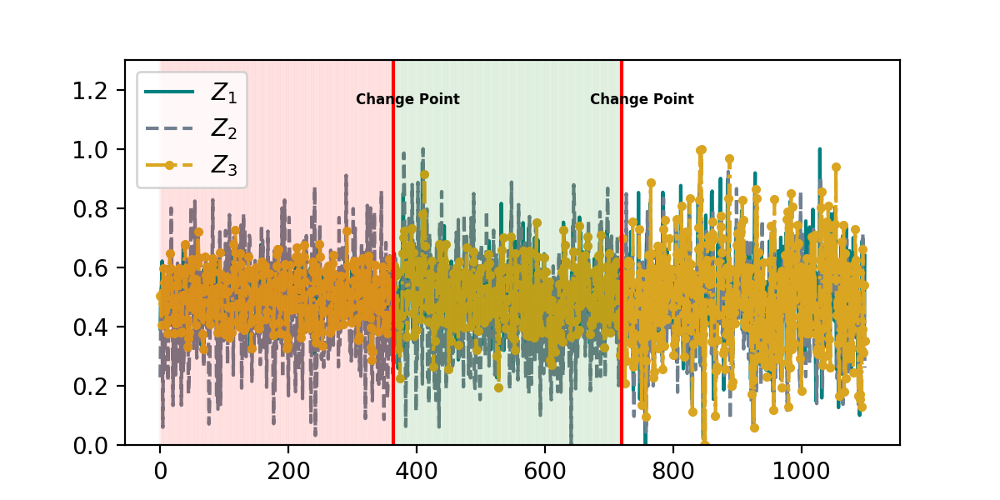

# Regime Identification

This repository contains code for our work on segmentation of multivariate non-stationary time series. Our goal is to identify regimes in multivariate non-stationary geo-climate time series and discover regime-specific causal graph using [CDMI](https://github.com/wasimahmadpk/deepCausality).


## Overview

We extract covariances matrics $\Sigma_i$ $i=1,...,n$ using a sliding window of size $s$. The pool of the covariances matrices is given to clustering algorithm for segmentation.
1. We use KMeans algorithm to distinguish different dynamics in the multivariate non-stationary time series.
2. Since the covariance matrices have high nonlinear geometry therefore we use Riemannian distance as a metric for estimating the distance between regimes. For performance comparision, we also conduct experiments with Euclidean metric.


## Code
`src/regimes.py` is our main file, where we segment time series into batches that have specific dynamics.
- `src/regimes_identification.ipynb` is jupyter notebook for data analysis and segmentation.
- `datasets/` contains the generated synthetic data and real dataset.


```python 
# libraries
import regimes
import pandas as pd
```

```python
# Read synthetically generated time series
data = pd.read_csv(r'../datasets/synthetic_datac.csv')
# Desired number of segments (k). Set k=None to let the algorithm aumotically find opitmal k.
k = 2                
# sliding window size
winsize = 150

# Distance measure (Riemannian, Euclidean)
dist_metric = 'Riemannian'

# dim=n for reducing the dimension of covariance matrices to nxn. Use dim='full' for no dimensionality reduction. 
dim = 'full' 

# Retrieve segments labels along with the corresponding indices
clusters, cluster_idx, *_ = regimes.get_regimes(data, winsize, dist_metric, k, dim)
```

```python
# plot multivariate time-series with identified segments
regimes.plot_regimes(data, clusters, cluster_idx, winsize, dtype='synthetic')
```

<p align="center">

</p>


## Data
We test our method on synthetically generated multivariate nonlinear non-stationary time series as well as geo-climate time series which is recorded at Moxa Geodynamic Observatory (MGO) Jena. The data can be found under `datasets/` directory. 


## Dependencies
The file `requirements.txt` contains all the packages that are related to the project.
To install them, simply create a new [conda](https://docs.conda.io/en/latest/) environment and type
```
pip install -r requirements.txt
```

