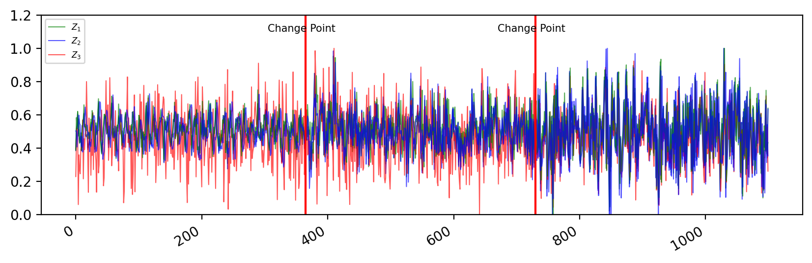

# Regime Identification

This repository contains code for our work on segmentation of multivariate non-stationary time series. Our goal is to identify regimes in time series discover regime-specific causal graph in geo-climate time series using [CDMI](https://github.com/wasimahmadpk/deepCausality).


## Overview

We extract covariances matrics $\Sigma_i$ $i=1,...,n$ using a sliding window of size $s$. The pool of the covariances matrices is given to clustering algorithm for segmentation.
1. We use KMeans algorithm to distinguish different dyanmices in the time series.
2. Since the covariance matrices have high nonlinear geometry therefore we use Riemannian distance as a metric for estimating the distance between regimes.


<p align="center">

</p>

## Data
We test our method on synthetically generated multivariate nonlinear non-stationary time series as well as geo-climate time series (Recorded at Moxa Geodynamic Observatory) which can be found under `datasets/` directory. The synthetic data is generated using file `src/synthetic_dataset.py`. 


## Code
`src/regimes.py` is our main file, where we segment time series into batches that have specific dynamics.
- `src/regimes_identification.ipynb` is jupyter notebook for data analysis and segmentation.
- `src/plot_regimes.py` for visualization of time series segmention.
- `datasets/` contains the generated synthetic data and real dataset.


## Dependencies
`requirements.txt` contains all the packages that are related to the project.
To install them, simply create a new [conda](https://docs.conda.io/en/latest/) environment and type
```
pip install -r requirements.txt
```

